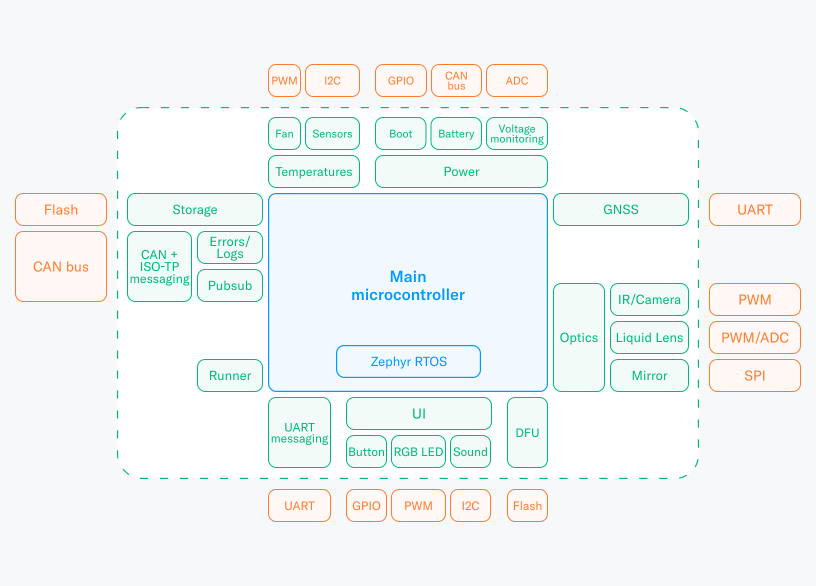

# Orb's microcontrollers firmware

The main microcontroller in the Orb is responsible for a wide range of critical tasks to ensure the device's
functionality and reliability. Its duties encompass powering on the Orb by initiating a specific sequence for the Jetson
and activating multiple power lines with various voltages, while simultaneously monitoring these voltages at a high
frequency to detect any failures. It also oversees the Orb's internal temperatures, voltage levels, and
logs any errors or warnings that occur during operation. The microcontroller and the Jetson communicate over the CAN bus
Optically, the Orb is an intricate device, and the microcontroller coordinates IR LED and camera
synchronization, ensures safety, controls the liquid lens, and adjusts the mirror for optimal operation. For user
interaction, it handles button inputs for power and starting signups and controls RGB LEDs for visual feedback.
The [mcuboot](https://github.com/mcu-tools/mcuboot) bootloader manages the [Zephyr](https://www.zephyrproject.org/)
[application](https://docs.zephyrproject.org/latest/develop/application/index.html) in two slots, allowing for
over-the-air updates with rollback capabilities.



The Orb comes in two different hardware versions. Support for both is provided in this repository:

- Pearl: [Current hardware iteration of the Orb](https://github.com/worldcoin/orb-hardware), which [you can find around
  the world](https://worldcoin.org/find-orb).
- Diamond: Next hardware iteration of the Orb that will be released in the future. It is currently in development
  and might be subject to breaking changes.

## Setting Up Development Environment

You can set up your development environment directly on your machine (preferred for Windows users), or you may
use the provided Docker image. A step-by-step guide is available below.
Note that all of these steps assume that you have an SSH key set up properly with GitHub
and that you have access to all the microcontrollers repos. These repositories are
enumerated in the [west.yml](west.yml) file.

### Generic Steps

1. Install the `west` meta-tool.

   ```shell
   pip3 install west
   ```

2. Create an empty directory where the projects and dependencies will be located.

   ```shell
   export REPO_DIR=$HOME/firmware # or any other directory
   mkdir "$REPO_DIR"
   ```

3. Clone the manifest repository using west.

   ```shell
   cd "$REPO_DIR"
   west init -m <repo-url.git> --mr main
   ```

   This will create a directory called `orb`.

4. Now import all projects and dependencies.

   ```shell
   west update
   ```

#### Docker

5. If you prefer to use Docker, you can use the provided [Dockerfile](utils/docker/Dockerfile).
   ```shell
    cd "$REPO_DIR"/orb/public/utils/docker
    make build
    make shell
   ```

#### Native

These instructions are mainly just an adaptation of the instructions in
the [Zephyr getting started guide](https://docs.zephyrproject.org/latest/getting_started/index.html).

5. Install the dependencies. Two ways:

   - Follow instructions in this section
     for [installing dependencies](https://docs.zephyrproject.org/latest/getting_started/index.html#install-dependencies).
     - Then:
       ```shell
       pip3 install -r "$REPO_DIR"/zephyr/scripts/requirements.txt
       ```
   - Or install the Conda environment provided [here](utils/env/environment.yml).
     ```shell
     conda env create -f orb/public/utils/env/environment.yml
     conda activate worldcoin
     ```

6. Install a toolchain.

   You may change `INSTALL_LOC` to choose an installation location.
   You may also change `SDK_VER` to choose a specific toolchain version:

   ```shell
   export SDK_VER=0.16.5
   ```

   This script will install the Zephyr SDK in your home directory:

   ```shell
   tmp=$(mktemp)
   cat > "$tmp" <<EOF
   #!/bin/bash
   set -ue
   set -o pipefail
   install_zephyr_sdk() {
    INSTALL_LOC=\$HOME
    KERNEL=\$(uname -s | tr '[[:upper:]]' '[[:lower:]]')
    [ "\$KERNEL" = darwin ] && KERNEL=macos
    ARCH=\$(uname -m)
    [ "\$ARCH" = arm64 ] && ARCH=aarch64
    if [ -z "\${SDK_VER-}" ]; then
        if ! SDK_VER=\$(curl -s https://api.github.com/repos/zephyrproject-rtos/sdk-ng/releases/latest \\
            | grep tag_name \\
            | awk '{print substr(\$2, 3, length(\$2)-4)}'); then
            echo "Some error occurred when trying to determine the latest SDK version" >&2
            return 1
        fi
    fi
    echo "SDK_VER is '\$SDK_VER'"
    TAR_NAME=zephyr-sdk-\${SDK_VER}_\${KERNEL}-\${ARCH}_minimal.tar.xz
    echo "TAR_NAME is \$TAR_NAME"
    URL=https://github.com/zephyrproject-rtos/sdk-ng/releases/download/v\${SDK_VER}/\${TAR_NAME}
    if [ ! -e "\$INSTALL_LOC/zephyr-sdk-\${SDK_VER}/.__finished" ]; then
        echo "Downloading \${TAR_NAME}..." &&
        ( cd "\$INSTALL_LOC" && curl -JLO "\$URL" ) &&
        echo 'Decompressing...' &&
        (cd "\$INSTALL_LOC" && tar xf "\$TAR_NAME" ) &&
        ( cd "\$INSTALL_LOC"/zephyr-sdk-\${SDK_VER} &&
        ./setup.sh -t arm-zephyr-eabi -h -c ) &&
        rm "\$INSTALL_LOC/\$TAR_NAME" &&
        echo > "\$INSTALL_LOC"/zephyr-sdk-\${SDK_VER}/.__finished
    else
        echo "SDK already exists. Skipping."
    fi
   }
   install_zephyr_sdk
   EOF
   chmod +x "$tmp"
   "$tmp"
   ```

7. (Linux-based OS) Install udev rules to allow for flashing as a non-root user

   ```shell
   # make sure to set $SDK_VER, based on previous step
   sudo cp zephyr-sdk-${SDK_VER}/sysroots/x86_64-pokysdk-linux/usr/share/openocd/contrib/60-openocd.rules /etc/udev/rules.d
   sudo udevadm control --reload
   ```

8. Install the protobuf compiler.

   ```shell
   if [ "$(uname -s)" = Darwin ]; then
       brew install protobuf-c
   else
       sudo apt install protobuf-compiler
   fi
   pip3 install protobuf grpcio-tools
   ```

9. Install CMSIS Pack for PyOCD

   ```shell
   pyocd pack install stm32g474vetx
   ```

10. Export CMake packages.

```shell
cd "$REPO_DIR"
west zephyr-export
```

Your directory structure now looks similar to this:

```
firmware
├── bootloader (mcuboot)
├── modules (dependencies)
├── orb (this repository)
└── zephyr (os)
```

#### Finally, to Build and Flash

See the board-specific documentation for the [main board](main_board/README.md).

#### Debugging

Use [openOCD with Zephyr patches](https://github.com/zephyrproject-rtos/openocd) to get the most out of your
debugging experience, either from the [Zephyr SDK](https://github.com/zephyrproject-rtos/sdk-ng) (in Host Tools) or
compiled manually using [this script](utils/env/compile_openocd.sh).

To fully use the thread-aware debugging, make sure to use:

```conf
CONFIG_DEBUG_THREAD_INFO=y
```

#### Logging

Print out the bootloader and main MCU application logs using:

```shell
# replace /dev/ttyxxx with your UART device
python "$REPO_DIR"/orb/public/utils/debug/uart_dump.py -p /dev/ttyxxx -b 115200
```

## Contributing

See [the contribution guide](CONTRIBUTING.md).

## What's not included

There are 2 microcontrollers in the Orb, the _main_ and the _security_ microcontrollers. This repository initially
contains source code for both but, because the security features of the Orb are not open-sourced at the moment,
the security microcontroller source code has been removed.

### Private repositories

For people with access to the private repositories, West tracks the repositories to pull in your workspace and all you
need to do is to enable the `internal` group in the West configuration:

```shell
west config --local manifest.group-filter "+internal"
west update
```

## License

Unless otherwise specified, all code in this repository is dual-licensed under
either:

- MIT License ([LICENSE-MIT](LICENSE-MIT))
- Apache License, Version 2.0, with LLVM Exceptions
  ([LICENSE-APACHE](LICENSE-APACHE))

at your option. This means you may select the license you prefer to use.

Any contribution intentionally submitted for inclusion in the work by you, as
defined in the Apache-2.0 license, shall be dual licensed as above, without any
additional terms or conditions.
